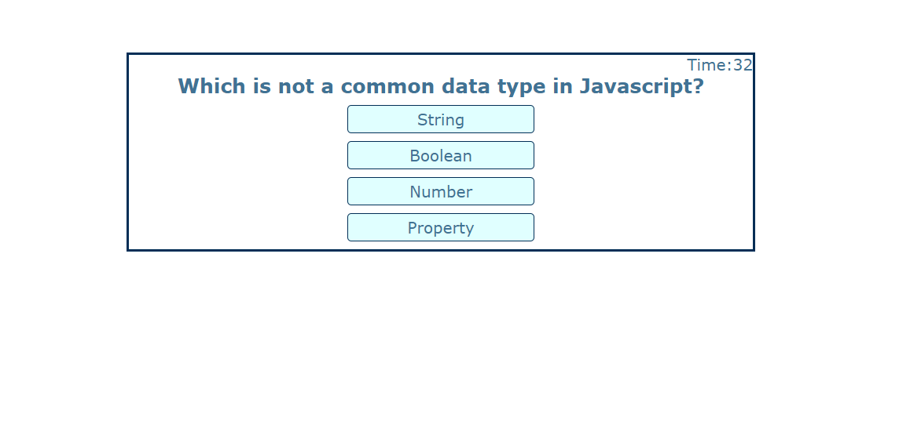

# Coding Quiz Challenge

## Objective of Challenge

* Create a timed quiz on JavaScript fundamentals that collects and stores high scores

## Acceptance Criteria

* After clicking "Start", a timer begins and the first question appears
* After answering a question, the page will advance to the next question
* Points will be deducted if any question is incorrect
* Quiz is complete when all questions are answered or the timer reaches 0
* A highscore with initials and score can be entered into the localStorage

## Tools used:

* HTML
* CSS
* Javascript

## Links 

:stuck_out_tongue:[Deployed Website](https://github.com/RPB543/js-coding-quiz-rpb)\
:relieved:[Repo](https://github.com/RPB543/js-coding-quiz-rpb)\
:smiley: [Github](https://github.com/RPB543)

## Screenshot
